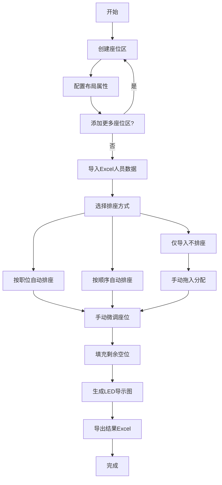

# 球场/会场排座系统 - 产品需求文档 (PRD)

## 1. 产品概述
一个专为大型会议、活动、典礼设计的可视化座位编排工具。解决传统手工排座耗时、易错、难以全局调整的问题。面向活动组织方、会务公司，支持灵活布局、Excel快速排座、拖拽微调和LED大屏导示。

## 2. 核心功能

### 2.1 用户角色
| 角色 | 说明 | 核心权限 |
|------|------|----------|
| 排座操作员 | 唯一角色，无需登录 | 所有功能：布局编辑、导入排座、调整、导出 |

### 2.2 功能模块
1. **座位布局编辑器**：可视化画布，创建/编辑座位区，配置行列、间距、角度、过道
2. **Excel快速排座**：导入人员数据，按职位/顺序自动排座
3. **全局座位调整**：拖拽交换、拖入分配、清空、一键填充空位
4. **LED导示图**：生成全局俯瞰图，导出PNG，全屏预览
5. **结果导出**：排座结果导出为Excel

### 2.3 页面详情
| 页面名称 | 模块名称 | 功能描述 |
|----------|----------|----------|
| 主工作台 | 顶部工具栏 | 添加座位区、导入Excel、按职位排座、按顺序排座、填充空位、LED导示图、导出Excel |
| 主工作台 | 左侧人员面板 | 显示待排人员列表（可折叠），支持拖拽人员到座位 |
| 主工作台 | 右侧属性面板 | 编辑选中座位区的属性（行列数、尺寸、角度、过道等），支持折叠 |
| 主工作台 | 中央画布 | Konva交互画布，支持缩放/平移，渲染所有座位区，支持拖拽调整 |
| 弹窗 | Excel导入向导 | 四步流程：上传文件→数据预览→字段映射→确认导入并排座 |
| 弹窗 | LED导示图 | 全局俯瞰预览，支持导出PNG和全屏展示 |

## 3. 核心流程

## 4. 用户界面设计

### 4.1 设计风格
- **主题**: 深色专业风格，传达严谨、高效的工具属性
- **主色调**: 深邃蓝黑 `#0a0e1a` → 面板 `#141828`，点缀 `#4fc3f7` 电光蓝和 `#00e676` 翠绿
- **按钮**: 扁平圆角，悬停时轻微发光，主操作使用渐变描边
- **字体**: 标题使用非衬线几何字体，正文使用等宽或系统字体保证清晰
- **布局**: 左-中-右三栏式，可折叠侧边栏，中心画布占主导
- **视觉特色**: 微妙的网格背景纹理、座位区发光边框、拖拽时粒子反馈、状态指示灯光效

### 4.2 页面设计概览
| 页面名称 | 模块名称 | UI元素 |
|----------|----------|--------|
| 主工作台 | 顶部工具栏 | 深色半透明背景 `rgba(10,14,26,0.95)`，按钮组按功能分组，图标+文字标签 |
| 主工作台 | 左侧人员面板 | 280px宽，深灰背景 `#141828`，人员卡片带部门色标，拖拽时产生光晕 |
| 主工作台 | 中央画布 | 深色网格背景，座位区彩色半透明边框，固定座位金色描边，选中效果蓝色光晕 |
| 主工作台 | 右侧属性面板 | 260px宽，表单控件统一样式，过道配置使用可视化区间选择 |
| 弹窗 | Excel导入向导 | 步骤条引导，上传区虚线边框+拖拽动画，数据表格斑马纹 |
| 弹窗 | LED导示图 | 深色背景全屏模态，区域色块+标签，导出按钮浮动右下角 |

### 4.3 响应式
- 桌面优先设计，最小支持1280×720分辨率
- 侧边栏在小于1024px时自动折叠
- LED导示图适配常见16:9比例（1920×1080、1366×768）

### 4.4 设计风格方向
选择 **"赛博指挥中心"** (Cyber Command Center) 风格：
- 深色基底上使用发光霓虹色作为功能色
- 座位区使用半透明发光边框像全息投影
- 操作按钮使用微妙的渐变描边和发光效果
- 数据面板使用终端风格的等宽字体显示统计
- 画布网格线使用极低透明度的青色线条
- 微交互使用平滑过渡和微妙的光效反馈
