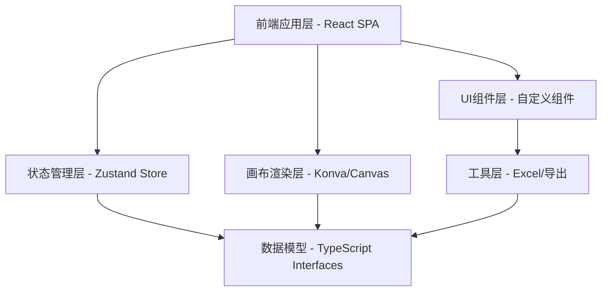
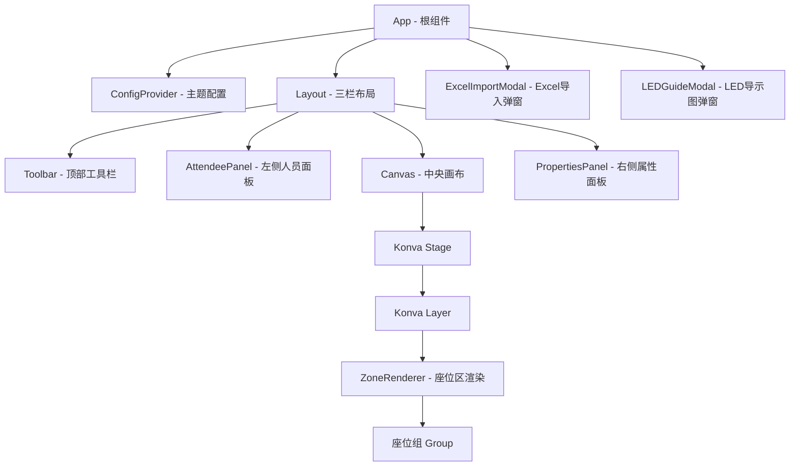
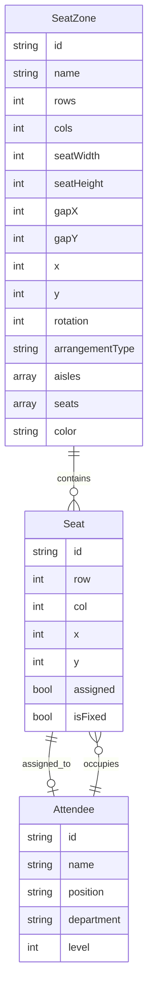
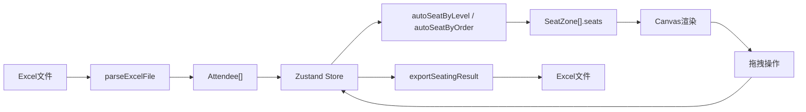

# 球场/会场排座系统 - 技术架构文档

## 1. 架构设计



纯前端单页应用，无后端、无数据库，所有数据存于内存状态中。

## 2. 技术描述

| 层级 | 技术选型 | 版本 | 用途 |
|------|----------|------|------|
| 框架 | React | ^18.3.1 | UI框架 |
| 语言 | TypeScript | ^5.5.4 | 类型安全 |
| 构建 | Vite | ^5.4.3 | 开发/构建工具 |
| 画布 | Konva + react-konva | ^9.3.15 / ^18.2.10 | 座位布局画布 |
| 状态 | Zustand | ^4.5.2 | 全局状态管理 |
| Excel | xlsx (SheetJS) | ^0.18.5 | Excel读写 |
| 截图 | html2canvas | ^1.4.1 | LED导示图导出 |
| 样式 | CSS Custom Properties | - | 主题系统 |
| 字体 | Google Fonts: Orbitron + Noto Sans SC | - | 标题 + 正文 |

## 3. 路由定义

单页应用，无需路由：

| 路由 | 用途 |
|------|------|
| / | 主工作台（唯一页面，弹窗实现子功能） |

## 4. 组件树



## 5. 数据模型

### 5.1 数据模型定义



### 5.2 数据流



## 6. 文件结构

```
src/
├── main.tsx              # 入口
├── App.tsx               # 根组件
├── index.css             # 全局样式（赛博主题）
├── types.ts              # TypeScript类型定义
├── store.ts              # Zustand状态管理
├── vite-env.d.ts         # Vite类型声明
├── components/
│   ├── Toolbar.tsx       # 顶部工具栏
│   ├── Canvas.tsx        # Konva画布
│   ├── AttendeePanel.tsx # 待排人员面板
│   ├── PropertiesPanel.tsx # 属性编辑面板
│   ├── ExcelImportModal.tsx # Excel导入弹窗
│   └── LEDGuideModal.tsx # LED导示图弹窗
└── utils/
    └── excel.ts          # Excel读写工具
```
